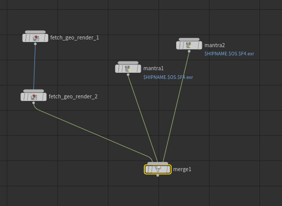
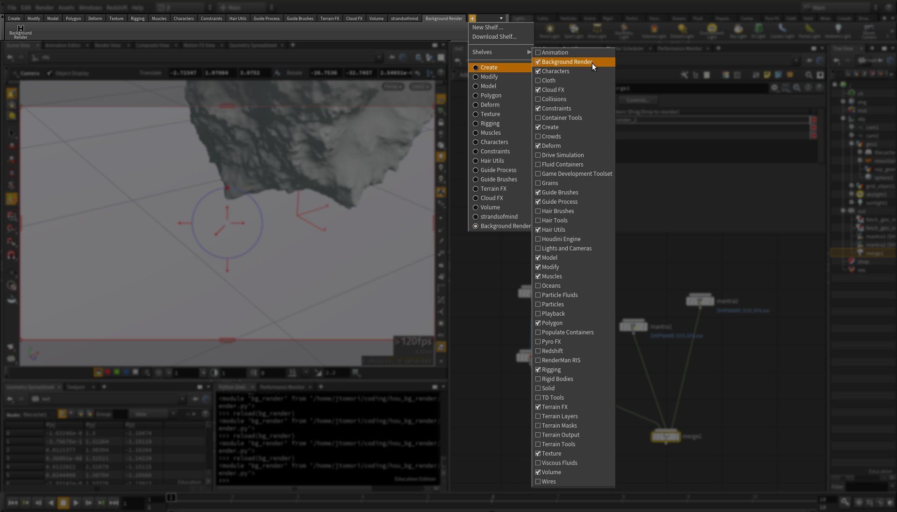

Houdini Background Render
=========================
*Render any renderable node in background.*<br>
*Works on Linux and Windows*<br>


Installation
------------
1. [Download](https://github.com/jtomori/hou_bg_render/archive/master.zip) or clone this repository.


2. Add this repository into your *HOUDINI_PATH* environment variable. 
    * For example by adding this line into your *houdini.env* file:
    ```
    HOUDINI_PATH = &:/path/to/this/folder
    ```
    * If you have set your *HOUDINI_PATH* variable already, then use followig line.
    ```
    HOUDINI_PATH = $HOUDINI_PATH;/path/to/this/folder
    ```

3. Enable shelf in Houdini
    

Usage
-----
* Select a renderable node(s) and click on the shelf tool.
* ALT-Click for *frame-by-frame* mode, default mode is *node-by-node*
* Check the new-opened terminal window for progress.
* Continue working on your scene :)